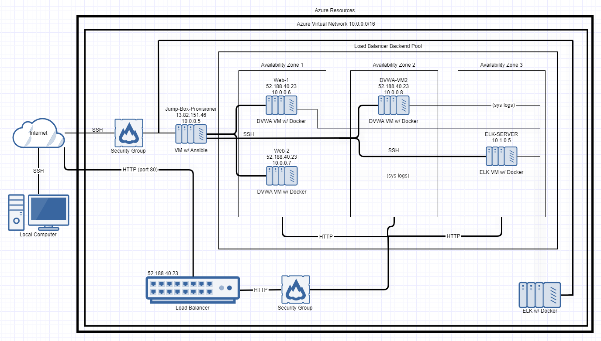
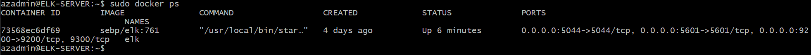

# Elk-Stack-Project
## Automated ELK Stack Deployment

The files in this repository were used to configure the network depicted below.

These files have been tested and used to generate a live ELK deployment on Azure. They can be used to either recreate the entire deployment pictured above. Alternatively, select portions of the playbook file may be used to install only certain pieces of it, such as Filebeat.

  - [elk_playbook.yml](Playbooks/elk_playbook.yml)
  - [filebeat_playbook.yml](Playbooks/filebeat_playbook.yml)
  - [Metricbeat_playbook.yml](Playbooks/Metricbeat_playbook.yml)

This document contains the following details:
- Description of the Topologu
- Access Policies
- ELK Configuration
  - Beats in Use
  - Machines Being Monitored
- How to Use the Ansible Build

### Description of the Topology

The main purpose of this network is to expose a load-balanced and monitored instance of DVWA, the D*mn Vulnerable Web Application.

Load balancing ensures that the application will be highly available, in addition to restricting inbound access to the network.

Integrating an ELK server allows users to easily monitor the vulnerable VMs for changes to the log files and system metrics.

The configuration details of each machine may be found below.

| Name                 | Function   | IP Address | Operating System |
|----------------------|------------|------------|------------------|
| Jump-Box-Provisioner | Gateway    | 10.0.0.5   | Linux            |
| Web-1                | Web Server | 10.0.0.6   | Linux            |
| Web-2                | Web Server | 10.0.0.7   | Linux            |
| DVWA-VM2             | Web Server | 10.0.0.8   | Linux            |
| ELK-SERVER           | Monitoring | 10.1.0.5   | Linux            |

### Access Policies

The machines on the internal network are not exposed to the public Internet. 

Only the Jump-Box-Provisioner machine can accept connections from the Internet. Access to this machine is only allowed from the following IP addresses:
- 73.137.47.155

Machines within the network can only be accessed by each other.

A summary of the access policies in place can be found in the table below.

| Name                 | Publicly Accessible | Allowed IP Addresses      |
|----------------------|---------------------|---------------------------|
| Jump-Box-Provisioner | Yes                 | 73.137.47.155             |
| Web-1                | No                  | 10.0.0.0-254              |
| Web-2                | No                  | 10.0.0.0-254              |
| DVWA-VM2             | No                  | 10.0.0.0-254              |
| ELK-SERVER           | No                  | 10.0.0.0-254 10.1.0.0-254 |

### Elk Configuration

Ansible was used to automate configuration of the ELK machine. No configuration was performed manually, which is advantageous because it allowed multiple duplicate VMs to be setup.

The playbook implements the following tasks:
- Install docker.io
- Install Python3
- Install the python docker module
- Increase the system memory
- Download and Launch a docker ELK container

The following screenshot displays the result of running `docker ps` after successfully configuring the ELK instance.

### Target Machines & Beats
This ELK server is configured to monitor the following machines:
- Web-1 at 10.0.0.6
- Web-2 at 10.0.0.7
- DVWA-VM2 at 10.0.0.8

We have installed the following Beats on these machines:
- Filebeat
- Metricbeat

These Beats allow us to collect the following information from each machine:
- Filebeat: Used to detect changes to the log files in a system, such as when the log files in Apache make changes.
- Metricbeat: Used to detect any changes to the system's metrics, such as CPU or RAM usage.

### Using the Playbook
In order to use the playbook, you will need to have an Ansible control node already configured. Assuming you have such a control node provisioned: 

SSH into the control node and follow the steps below:
- Copy the playbook file to the Ansible machine.
- Update the configuration file to include ELK-SERVER's IP
- Run the playbook, and navigate to ELK-SERVER's public IP to check that the installation worked as expected.
